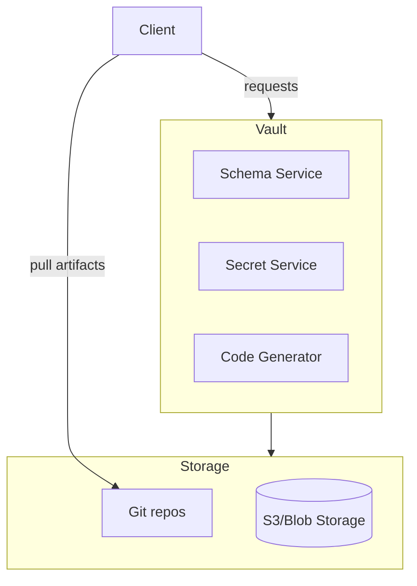

# Vault High Level Architecture

This document sketches the major components for a secure, read-only registry called **Vault**.

## Overview

- **Purpose**: Provide a canonical store for schemas, generated code, skeletons, and potentially secrets. The role of secrets is still under active discussion.
- **Traits**: Immutable history, versioned artifacts, minimal write surface, strong access controls.

## Component Highlights

- **Schema Service**: Validates and stores versioned schemas.
- **Secret Service**: Interfaces with KMS or HSM to manage encrypted secrets (may live elsewhere).
- **Code Generator**: Provides framework skeletons and generated code artifacts.
- **Read-Only**: Majority of users only read; writes require elevated privileges and automated pipelines.

The architecture favors a layered approach with clear boundaries:

1. **Storage** – versioned repositories and object stores.
2. **Domain** – core logic for schema/secret management.
3. **Interfaces** – CLI or HTTP APIs for retrieval.

## Design Options

1. **Monolithic Vault** – Single repo containing schemas, generated code, project skeletons, and secrets. Simplifies discovery at the cost of mixing responsibilities.
2. **Vault + Secret Repo** – Core Vault repository for code artifacts; a separate repo dedicated to secret storage. Aligns with Single Responsibility Principle and allows stricter access controls for secrets.
3. **Service-Oriented** – Minimal repo with schemas only, while code generation and secret management are delivered as independent services. Keeps Vault extremely focused and promotes encapsulation.

## Open Questions

- If secrets move to a different repo, how do we link them back to schema versions?
- Should code generation be triggered by CI in this repo or externally?

